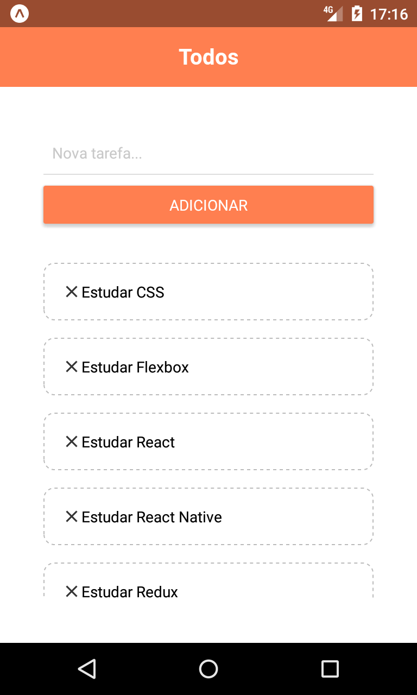
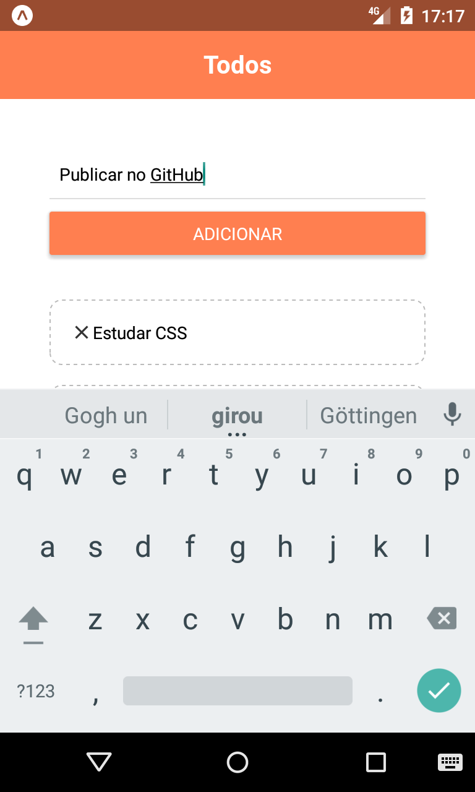
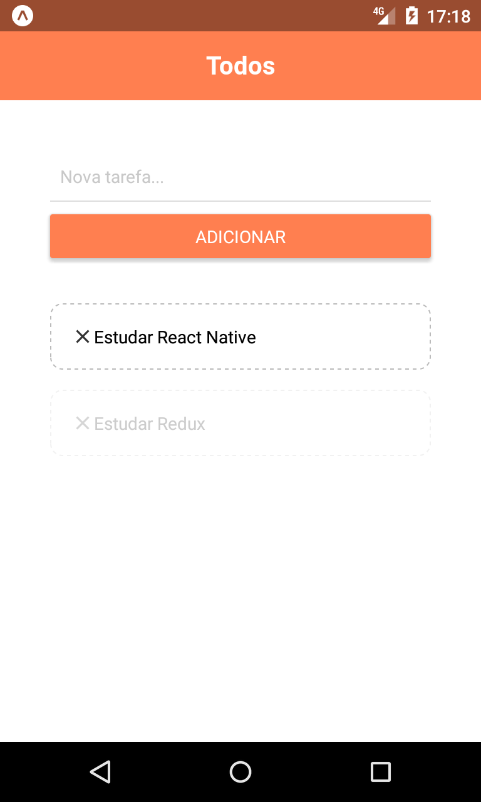

# Todo - Lista de tarefas com React Native

Aplicativo de lista de tarefas (sim, mais um!) desenvolvido para estudos de React Native, Hooks e componentes básicos do framework.

## Prévias da aplicação:

|                                             |                                            |                                                |                                                      |
| :-----------------------------------------: | :----------------------------------------: | :--------------------------------------------: | :--------------------------------------------------: |
|  |  |  |  |
|                                             |                                            |                                                |                                                      |

## Versões utilizadas:

- React 16.9.0
- React Native 0.61
- Expo 36.0.0

### Referências:

- https://facebook.github.io/react-native/docs/getting-started
- https://docs.expo.io/versions/latest/
- http://bit.ly/36YtkOE
